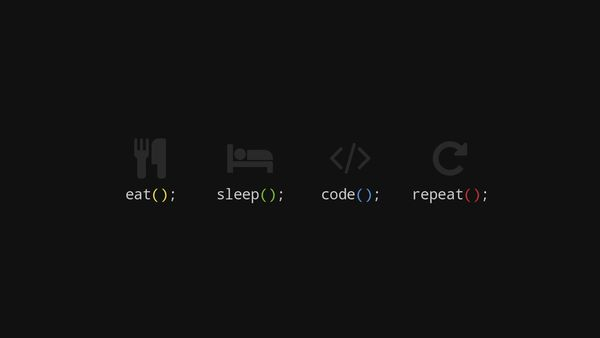

<!--- This is comment --->

We can use HTML seentext in Markdown file

<!-- Normal text & new line -->

This is normal text
& we can make new line  
to give two space end of the line or by using html br tag

<br>
<!-- Horizontal rule -->

---

we can create horizontal rule by using 3 minus or hr tag(---)

<hr>

<!-- Headings -->
<br>
<br>

Headings

# This is h1

## This is h2

### This is h3

#### This is h4

##### This is h5

###### This is h6

<br>
<p>This is peragraph</p>

_this is markdown italic_

**this is markdown Bold**

~~this is strikethrough~~

<br>
<!-- inline code block -->

### inline code block

`this is inline code block`

`<h3>this is inline code block</h3>`

<br>
<!-- Multiple line code block -->

### Multiple line code block

```
    <html>
    <head> </head>
    <body> </body>
    </html>
```

<!-- format/ color by own language name -->

```html
<html>
  <head> </head>
  <body></body>
</html>
```

```javascript
console.log("hell0");
```

<br>

<!-- List -->

### Ordered List

1. Item1
1. Item2
   1. Item2.1
   1. Item2.2
1. Item3
1. Item4

### Unordered List

- item 1
- item 2
  - item 2.1
  - item 2.2
- item 3

### Task List

-[x] Task1  
-[x] Task2  
-[] Task3

<!-- aita github a thik moto dekhabe -->
<br>

<!-- Link -->

### Autometic link

https://github.com/Md-Rakib-Rayhan

### Disable link

`https://github.com/Md-Rakib-Rayhan`

### Markdown link sytax

<!-- [title](link) -->

[my github](https://github.com/Md-Rakib-Rayhan)

[Instagram](instagram)

<!-- all link is here -->

[websitelink]: https://github.com/Md-Rakib-Rayhan
[instagram]: https://www.instagram.com/md.rakib_rayhan_/

<br>

<!-- Image -->

### Image sytax

<!--  -->



<!-- to set width height we can use html img tag -->

🙂😁

<br>

<!-- Table -->

### table

| Name             | Email  |
| ---------------- | ------ |
| Md. Rakib Rayhan | @gmail |
